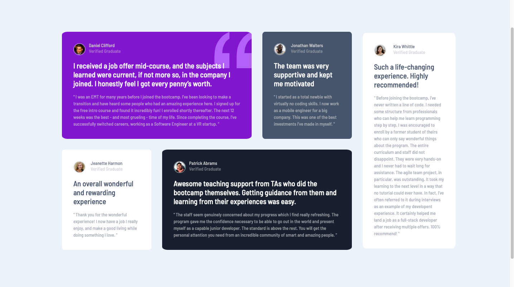

# Frontend Mentor - Testimonials grid section solution

This is a solution to the [Testimonials grid section challenge on Frontend Mentor](https://www.frontendmentor.io/challenges/testimonials-grid-section-Nnw6J7Un7). Frontend Mentor challenges help you improve your coding skills by building realistic projects. 

## Table of contents

- [Overview](#overview)
  - [The challenge](#the-challenge)
  - [Screenshot](#screenshot)
  - [Links](#links)
- [My process](#my-process)
  - [Built with](#built-with)
  - [What I learned](#what-i-learned)
  - [Continued development](#continued-development)
- [Author](#author)

## Overview

Testimonial Grid Main Section created with HTML,CSS (flexbox and Grid). 

### The challenge

Users should be able to:

- View the optimal layout for the site depending on their device's screen size

### Screenshot

### Links

- Solution URL: [https://your-solution-url.com](https://your-solution-url.com)
- Live Site URL: [https://osp-web.github.io/testimonial-grid/](https://osp-web.github.io/testimonial-grid/)

## My process

Took me 1 week to finish this project. I work with mobile version first and then proceed to website version. Within this period, took some time to learn CSS grid

### Built with

- Semantic HTML5 markup
- CSS custom properties
- Flexbox
- CSS Grid
- Mobile-first workflow

### What I learned

CSS Grid in this project

### Continued development

Focus on CSS Grid learning in the future and start learning Javascript

## Author

- Website - [osp-web](https://www.your-site.com)
- Frontend Mentor - [@osp-web](https://www.frontendmentor.io/profile/osp-web)
- Twitter - [@ospisosp]

